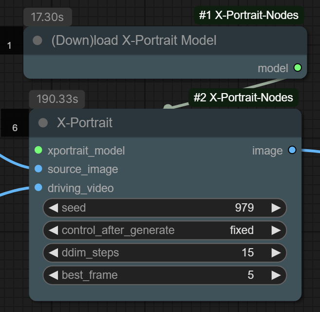
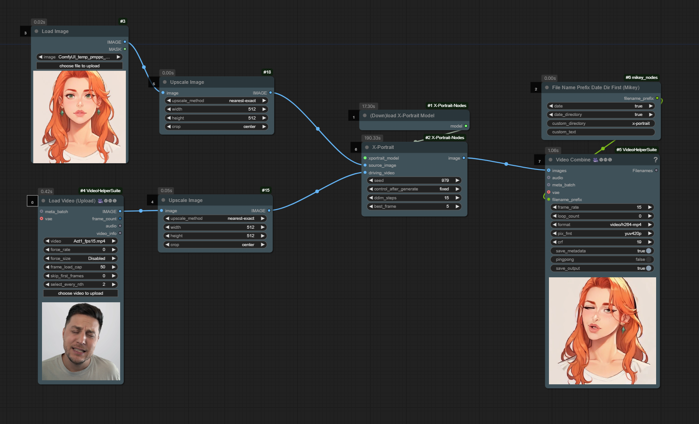

# X-Portrait Nodes

**Animate portraits with an input video and a reference image using X-Portrait in ComfyUI.**

[Original X-Portrait Repo](https://github.com/bytedance/X-Portrait)



- source_image: the reference image for generation, should be square and max 512x512.
- driving_video: the driving video containing a face, should match the resolution of the source_image and max 512x512.
- seed: controls current generation seed
- ddim_steps: how many samples (steps) for generating the output. Diminishing returns after 15.
- best_frame: which frame of the driving_video most closely matches the source_image.

## ⭐ Example Workflow (in examples/)



## 🔧 Installation and Usage

1. ComfyUI Manager:

- This node pack is available to install via the [ComfyUI Manager](https://github.com/ltdrdata/ComfyUI-Manager). You can find it in the Custom Nodes section by searching for "X-Portrait" and clicking on the entry called "X-Portrait Nodes".

2. Clone the repository:
- Navigate to ComfyUI/custom_nodes folder in terminal or command prompt.
- Clone the repo using the following command:
```bash
git clone https://github.com/akatz-ai/ComfyUI-X-Portrait-Nodes.git
```
- Restart ComfyUI
